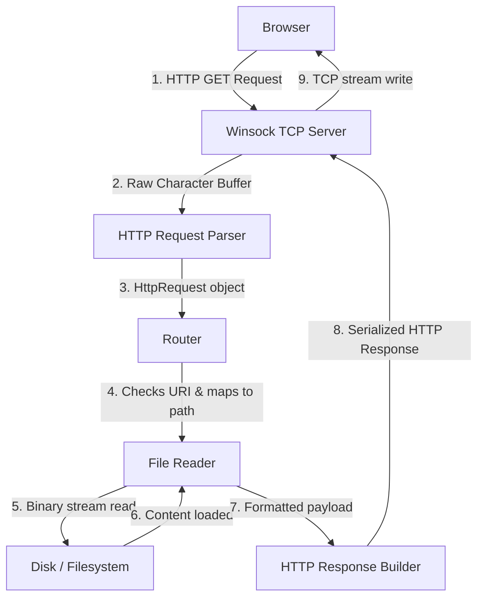
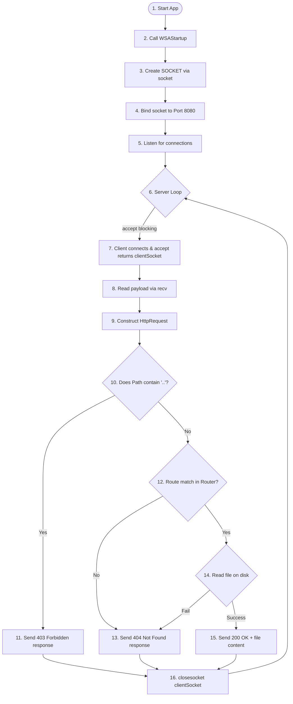

# C++ HTTP Web Server from Scratch (Winsock2)

A professional, high-performance, single-threaded HTTP/1.1 static file web server built from scratch in C++ on Windows. It utilizes the low-level **Windows Sockets 2 (Winsock2)** API to manage network sockets, handle client TCP connections, parse incoming HTTP requests, route paths, serve static assets (HTML, CSS, JS, images), and block directory traversal attacks.

This document serves as both standard repository documentation and a **comprehensive technical interview revision sheet** for low-level systems programming, networking, and Windows systems development.

---

## 📂 Folder Structure

The project maintains a clean separation of concerns, separating client request parsing, routing configurations, application entry point, and static public assets:

| Directory/File | Responsibility |
| :--- | :--- |
| 📁 [src](file:///c:/Users/hp/OneDrive/Desktop/cpp/cpp-webserver/src) | Houses the C++ source code files. |
| 📄 [main.cpp](file:///c:/Users/hp/OneDrive/Desktop/cpp/cpp-webserver/src/main.cpp) | Server entry point: handles Winsock initialization, socket lifecycle (`socket`, `bind`, `listen`, `accept`), client loop, static file loading, and response dispatching. |
| 📄 [http_request.h](file:///c:/Users/hp/OneDrive/Desktop/cpp/cpp-webserver/src/http_request.h) | Declares the `HttpRequest` class, representing parsed HTTP request lines. |
| 📄 [http_request.cpp](file:///c:/Users/hp/OneDrive/Desktop/cpp/cpp-webserver/src/http_request.cpp) | Implements HTTP request parsing using `std::stringstream` to extract the Method, URI, and HTTP Version. |
| 📄 [router.h](file:///c:/Users/hp/OneDrive/Desktop/cpp/cpp-webserver/src/router.h) | Declares the static utility `Router` class. |
| 📄 [router.cpp](file:///c:/Users/hp/OneDrive/Desktop/cpp/cpp-webserver/src/router.cpp) | Maps request URIs to physical files on the disk and determines the corresponding MIME types. |
| 📁 [public](file:///c:/Users/hp/OneDrive/Desktop/cpp/cpp-webserver/public) | The server's document root containing public static assets. |
| 📄 [index.html](file:///c:/Users/hp/OneDrive/Desktop/cpp/cpp-webserver/public/index.html) | The primary webpage served at `/` and `/index.html`. |
| 📄 [style.css](file:///c:/Users/hp/OneDrive/Desktop/cpp/cpp-webserver/public/style.css) | Custom styling for the status UI, served at `/style.css`. |
| 📄 [script.js](file:///c:/Users/hp/OneDrive/Desktop/cpp/cpp-webserver/public/script.js) | Client-side scripting validating JavaScript execution, served at `/script.js`. |
| 📄 [README.md](file:///c:/Users/hp/OneDrive/Desktop/cpp/cpp-webserver/README.md) | This documentation and quick-revision guide. |

---

## 🏗️ Project Architecture

The server acts as an event loop executing on a single main thread. It blocks on network calls and processes incoming requests sequentially.

### Architectural Flow



### ASCII Request-Response Pipeline

```text
    +------------------+                   +----------------------+
    |                  |   HTTP Request    |                      |
    |     Browser      | ----------------> |  Winsock TCP Server  |
    |  (Port Ephemeral)|                   |     (Port 8080)      |
    +------------------+                   +----------------------+
            ^                                         |
            |                                         | (Raw buffer string)
            | HTTP Response                           v
    +------------------+                   +----------------------+
    |                  |                   |                      |
    | Browser Renderer | <---------------- |     HTTP Parser      |
    |                  |   HTML/CSS/JS     | (Extracts HTTP Line) |
    +------------------+                   +----------------------+
            ^                                         |
            |                                         | (Method, Path, Version)
            | Raw Content                             v
    +------------------+                   +----------------------+
    |                  |                   |                      |
    |   File System    | <---------------- |      URI Router      |
    | (public/ folder) |   Reads Binary    |  (Translates Paths)  |
    +------------------+                   +----------------------+
```

---

## 🔄 Request Flow (Step-by-Step)

Here is exactly what happens behind the scenes when a user visits `http://localhost:8080` in their browser:

1. **DNS & Connection Request:** The browser resolves `localhost` to IP address `127.0.0.1` and initiates a TCP handshake on port `8080`.
2. **Backlog Queue:** The Windows OS network stack handles the TCP handshake and places the connection in the server's listening backlog queue.
3. **Accepting Connection:** The server, which was blocking on `accept()` in [main.cpp](file:///c:/Users/hp/OneDrive/Desktop/cpp/cpp-webserver/src/main.cpp#L132), wakes up, accepts the socket connection, and receives a dedicated client socket descriptor (`clientSocket`).
4. **Sending Request:** The browser transmits a plaintext HTTP request payload across the socket (e.g. `GET / HTTP/1.1\r\nHost: localhost:8080\r\n...`).
5. **Reading Socket:** The server calls `recv()` to extract the raw request string from the network card's buffer into a stack-allocated buffer.
6. **Parsing Request Line:** An instance of `HttpRequest` in [http_request.cpp](file:///c:/Users/hp/OneDrive/Desktop/cpp/cpp-webserver/src/http_request.cpp#L9) is constructed. It reads the first line and tokenizes it using `std::stringstream` to isolate the method (`GET`), requested path (`/`), and HTTP version (`HTTP/1.1`).
7. **Security Inspection:** The server validates the requested path. If it contains directory traversal sequence `".."` anywhere in the path, it halts processing and generates a `403 Forbidden` response.
8. **Routing Path:** The path `/` is passed to `Router::getFilePath()` in [router.cpp](file:///c:/Users/hp/OneDrive/Desktop/cpp/cpp-webserver/src/router.cpp#L6), which returns the relative path `public/index.html`.
9. **Disk Access:** The helper function `readFile()` opens `public/index.html` via `std::ifstream` in binary mode (`ios::binary`) and loads the content into memory.
10. **Assembling Response:** The server formats a compliant HTTP/1.1 response string containing:
    - Status line (`HTTP/1.1 200 OK`)
    - Headers (`Content-Type: text/html`, `Content-Length: <size>`, `Connection: close`)
    - Two newlines (`\r\n\r\n`) representing the header boundary
    - The raw binary contents of the file.
11. **Transmitting Response:** The response payload is sent to the client socket using `send()`.
12. **Closing Socket:** The server closes `clientSocket` via `closesocket()`, which forces TCP connection teardown (since `Connection: close` was specified).
13. **Subsequent Assets:** The browser parses the HTML and identifies requests for `style.css` and `script.js`. It executes separate concurrent TCP requests, repeating steps 1–12 for each asset.

---

## 🌐 Networking Concepts (Quick Revision)

> [!TIP]
> **Revision Tip:** Interviewers love asking about TCP vs UDP and network byte order. Memorize the byte-order translation function names (`htons`/`htonl`) and why they are necessary.

*   **Client vs Server:** The client initiates connection requests (active socket); the server listens for connection requests, binds to a port, and responds to clients (passive socket).
*   **Socket:** An abstraction representing an endpoint for transmitting or receiving data across a computer network. In Winsock, a socket is represented by the `SOCKET` file-descriptor handles.
*   **TCP (Transmission Control Protocol):** A connection-oriented, reliable protocol that guarantees ordered, error-checked delivery of a stream of octets (bytes) via handshakes, sequence numbers, and acknowledgments.
*   **Why TCP instead of UDP:** HTTP requires complete, lossless transmission of files (HTML, JS, images). If packets are lost (as in UDP), files get corrupted. TCP guarantees reliability and packet ordering, which is vital for web pages.
*   **IP Address:** A numerical identifier assigned to each device on a network (e.g. `127.0.0.1` for local loopback) representing the device's location to route data.
*   **Port:** A 16-bit numerical identifier (0–65535) that directs network traffic to a specific application or process on a machine (e.g. port `8080` for our HTTP server).
*   **Winsock (Windows Sockets):** A technical specification and library (`ws2_32.dll`) defining how Windows network software accesses network services (specifically TCP/IP).
*   **Blocking Sockets:** Sockets that halt thread execution on function calls (like `accept()`, `recv()`) until a network event occurs (e.g., a client connects or data is received).
*   **Network Byte Order:** Big-Endian representation (most significant byte stored at the lowest memory address), which is the standard format for packet headers sent over TCP/IP networks.
*   **htonl() (Host to Network Long):** Converts a 32-bit integer (typically an IPv4 address) from host byte order (which might be Little-Endian on Intel/AMD x86/x64 systems) to Network Byte Order (Big-Endian).
*   **htons() (Host to Network Short):** Converts a 16-bit integer (typically a port number, e.g. `8080`) from host byte order to Network Byte Order (Big-Endian).

---

## 🛠️ Winsock Functions Cheat Sheet

All network communications run through Winsock2 functions. Below is their purpose, syntax, and place in the server lifecycle.

### 1. WSAStartup
*   **Purpose:** Initializes the Windows Sockets DLL (`ws2_32.dll`) for the process.
*   **Syntax:**
    ```cpp
    int WSAStartup(WORD wVersionRequired, LPWSADATA lpWSAData);
    ```
*   **When used:** The very first network-related call in the program.

### 2. socket
*   **Purpose:** Creates a socket bound to a specific transport protocol.
*   **Syntax:**
    ```cpp
    SOCKET socket(int af, int type, int protocol);
    ```
*   **When used:** Creates the listener server socket. We call `socket(AF_INET, SOCK_STREAM, IPPROTO_TCP)`.

### 3. bind
*   **Purpose:** Associates a local network address (IP) and port number with a socket descriptor.
*   **Syntax:**
    ```cpp
    int bind(SOCKET s, const sockaddr *name, int namelen);
    ```
*   **When used:** Called right after socket creation to anchor the socket to port `8080`.

### 4. listen
*   **Purpose:** Places a socket in a state where it is actively listening for incoming client connection requests.
*   **Syntax:**
    ```cpp
    int listen(SOCKET s, int backlog);
    ```
*   **When used:** Prepares the server socket to receive connections, specifying a queue capacity (e.g., `SOMAXCONN`).

### 5. accept
*   **Purpose:** Extracts the first connection request in the queue and creates a new socket for client communication.
*   **Syntax:**
    ```cpp
    SOCKET accept(SOCKET s, sockaddr *addr, int *addrlen);
    ```
*   **When used:** Executes inside the main server loop. It blocks thread execution until a client connects.

### 6. recv
*   **Purpose:** Receives incoming data payload from a connected client socket.
*   **Syntax:**
    ```cpp
    int recv(SOCKET s, char *buf, int len, int flags);
    ```
*   **When used:** After a client connects, reads the plaintext HTTP request headers into the server's buffer.

### 7. send
*   **Purpose:** Transmits formatted data payload over a connected socket.
*   **Syntax:**
    ```cpp
    int send(SOCKET s, const char *buf, int len, int flags);
    ```
*   **When used:** After routing and file reads, dispatches the HTTP headers and binary content back to the client.

### 8. closesocket
*   **Purpose:** Closes a socket connection and releases the descriptor back to the OS.
*   **Syntax:**
    ```cpp
    int closesocket(SOCKET s);
    ```
*   **When used:** Called on the client socket after transmitting the HTTP response, and on the server socket during shutdown.

### 9. WSACleanup
*   **Purpose:** Terminates the use of the Winsock2 DLL, releasing system resources allocated to the socket stack.
*   **Syntax:**
    ```cpp
    int WSACleanup(void);
    ```
*   **When used:** The last call in the application before exiting.

---

## 📝 HTTP Quick Revision

HTTP (Hypertext Transfer Protocol) is a stateless, application-layer protocol running over TCP.

```
       HTTP Request:
       GET /index.html HTTP/1.1\r\n
       Host: localhost:8080\r\n
       Connection: close\r\n\r\n

       HTTP Response:
       HTTP/1.1 200 OK\r\n
       Content-Type: text/html\r\n
       Content-Length: 1112\r\n
       Connection: close\r\n\r\n
       [File Binary Payload Data...]
```

### Key Elements of HTTP

*   **HTTP Request:** Plain-text payload consisting of a Request Line (Method, URI, Version), headers (key-value pairs), and an optional body.
*   **HTTP Response:** Plain-text header block consisting of a Status Line (HTTP Version, Code, Reason Phrase), headers, and the raw payload body.
*   **GET Method:** Requests transfer of a representation of the target resource. GET requests must be idempotent and should not modify server state.
*   **Status Codes:**
    *   `200 OK`: Request succeeded; payload contains the resource.
    *   `403 Forbidden`: Server understood request but refuses to authorize it (used for Directory Traversal blocks).
    *   `404 Not Found`: Server cannot find resource corresponding to URI path.
*   **Headers:**
    *   `Content-Length`: Size of response body in bytes. Crucial for client parser to know when to stop reading the stream.
    *   `Connection`: Set to `close` to tell client that socket will be severed upon completion, bypassing keep-alive multiplexing.
*   **MIME Types:** Multipurpose Internet Mail Extensions. Informs browser of file types so it renders them correctly (e.g. `text/html`, `text/css`, `application/javascript`, `image/png`).

---

## 🔍 HTTP Request Parsing

Parsing is executed in the `HttpRequest` constructor within [http_request.cpp](file:///c:/Users/hp/OneDrive/Desktop/cpp/cpp-webserver/src/http_request.cpp#L9):

```cpp
HttpRequest::HttpRequest(const std::string& rawRequest) {
    stringstream requestStream(rawRequest);
    string requestLine;
    getline(requestStream, requestLine);
    stringstream lineStream(requestLine);

    lineStream >> method;
    lineStream >> path;
    lineStream >> version;
}
```

### How the Streams Work:
1.  `std::stringstream requestStream(rawRequest)` wraps the entire raw request buffer in an input stream.
2.  `std::getline(requestStream, requestLine)` reads the first line of the stream up to the newline character (`\n`), yielding the HTTP Request Line (e.g., `GET /index.html HTTP/1.1\r`).
3.  `std::stringstream lineStream(requestLine)` wraps that single request line.
4.  The formatted extraction operators (`lineStream >> method;`, etc.) read space-delimited string tokens. This extracts `GET` into `method`, `/index.html` into `path`, and `HTTP/1.1\r` into `version`.

> [!WARNING]
> **Common Mistake:** If you parse the entire request headers using a single stream without isolating `getline()` first, standard token extraction `>>` will fetch subsequent headers (like `Host:`) instead of the request line parameters.

---

## 🚦 Router Component

The server does not directly read file systems based on browser inputs; instead, the `Router` class maps request URIs to disk files.

### Why Routing is Needed
Routing acts as a mapping layer between the internet interface and private file layouts. Without it, clients could access arbitrary operating system files by supplying literal absolute path strings. It also determines MIME types, ensuring the browser doesn't execute CSS sheets as script tags.

### Mapping `/` to `public/index.html`
In [router.cpp](file:///c:/Users/hp/OneDrive/Desktop/cpp/cpp-webserver/src/router.cpp#L6):
```cpp
string Router::getFilePath(const string& path) {
    if (path == "/" || path == "/index.html") {
        return "public/index.html";
    }
    if (path == "/style.css") {
        return "public/style.css";
    }
    if (path == "/script.js") {
        return "public/script.js";
    }
    return "";
}
```
If a path matches a pre-mapped endpoint, it expands to point into the `public/` directory. Unmapped routes return an empty string, prompting the server to send a `404 Not Found` response.

---

## 💾 Static File Serving

Files are read in [main.cpp](file:///c:/Users/hp/OneDrive/Desktop/cpp/cpp-webserver/src/main.cpp#L41) using:
```cpp
bool readFile(const string &filePath, string &content) {
    ifstream file(filePath, ios::binary);
    if (!file.is_open()) {
        return false;
    }
    stringstream buffer;
    buffer << file.rdbuf();
    content = buffer.str();
    return true;
}
```

### Components Decoded:
*   **`ifstream file(filePath, ios::binary)`:** Opens the file in binary mode.
*   **`file.rdbuf()`:** Returns a pointer to the file stream's underlying raw stream buffer (`std::filebuf`). By piping this directly into `buffer`, C++ extracts the entire file content directly in a single step.
*   **`ios::binary` Importance:** Without `ios::binary`, Windows environments translate LF newlines (`\n`) to CRLF (`\r\n`) and treat control character `0x1A` (Ctrl+Z) as an End-Of-File (EOF) marker. Opening in binary mode guarantees byte-for-byte fidelity, ensuring binary payloads like images, compiled files, and CSS assets don't get corrupted.

---

## 🔒 Security Notes

> [!IMPORTANT]
> **Directory Traversal Vulnerability:** A web application exploit where directory sequences (`..`) are appended to request paths to escape the web server's document root directory and read system-restricted files (e.g. `GET /../../Windows/win.ini`).

This server mitigates this risk by checking the path string:
```cpp
if (request.getPath().find("..") != string::npos) {
    // Blocks directory traversal attempts immediately
    string response = "HTTP/1.1 403 Forbidden\r\n...";
    send(clientSocket, response.c_str(), response.size(), 0);
}
```

| Security Threat | Mitigation | Server Code Action |
| :--- | :--- | :--- |
| **Directory Traversal** | Sanitize path strings for sub-directory escape keys (`..`). | Checks request path for substring `".."` and returns `403 Forbidden` if found. |
| **Asset Leakage** | Explicitly define route mapping. | Denies arbitrary file lookups. Files not defined in `Router` return `404 Not Found` even if they exist in the directory. |

---

## 🔄 Project Flow Chart

The server's operation follows this execution sequence:



---

## 💎 Important C++ Concepts Used

*   **Classes:** Used to encapsulate state and logic, such as representing incoming requests (`HttpRequest`) or encapsulating routing utilities (`Router`).
*   **Constructors:** Special member functions called during object creation. `HttpRequest` uses its constructor to accept raw strings and parse them immediately.
*   **References (`const string&`):** Avoids copying large string buffers in memory. Passing by reference passes memory address pointers, saving heap and stack allocations.
*   **Namespaces (`using namespace std;`):** Simplifies code by removing the `std::` prefix from common library types (like `string` and `cout`).
*   **ifstream:** Input File Stream class used to perform read operations on files.
*   **stringstream:** Stream class that allows string buffers to be treated as streams, making tokenization and formatting easier.
*   **const:** Qualifier stating that a variable's value or object state cannot be modified after initialization.
*   **constexpr:** Specifies that a constant expression's value can be computed at compile-time rather than runtime (e.g. `constexpr int BUFFER_SIZE = 4096;`).
*   **Static methods:** Member functions that can be called without instantiating the class (e.g. `Router::getFilePath`).
*   **Header Files (`.h`):** Interface declarations that describe class layouts, function signatures, and macros to other modules.
*   **Source Files (`.cpp`):** Implementation details containing the actual logic declared in header files.

---

## 🐛 Common Bugs We Faced (And How to Resolve Them)

> [!WARNING]
> **Common Mistake:** Forgetting to link Winsock libraries or neglecting directory structure paths are the most common compilation and runtime mistakes in C++ network programming.

### 1. Missing WSAStartup Initialization
*   **Symptom:** Every subsequent network call fails with random system codes.
*   **Fix:** Ensure `WSAStartup` is executed and returns `0` before calls to `socket()` occur.

### 2. Bind Errors (Port Already in Use)
*   **Symptom:** `bind failed. Error Code: 10048` (WSAEADDRINUSE).
*   **Fix:** Ensure previous server instances are killed. Alternatively, change `htons(8080)` to an unused port like `8081` or configure `SO_REUSEADDR` options on the socket.

### 3. Wrong Working Directory (404 File Missing)
*   **Symptom:** Routing works, but `readFile()` fails, serving `404 Not Found`.
*   **Fix:** The executable expects a relative `public/` directory in its active working directory. If executing the program from outside `cpp-webserver/`, it won't locate `public/`. Run from the project root containing `public/`.

### 4. Wrong MIME Type Headers
*   **Symptom:** CSS styling doesn't apply to pages, console shows: *"Refused to apply style because its MIME type ('text/plain') is not a supported stylesheet MIME type..."*.
*   **Fix:** Modify `Router::getMimeType()` to check file extensions and return `text/css` instead of default `text/plain`.

### 5. Content-Length Mismatch
*   **Symptom:** Browsers load index pages forever, or cut off files mid-render.
*   **Fix:** Pass `to_string(fileContent.size())` explicitly in headers. Do not use string methods that rely on null-terminators if sending binary data, as binary files might contain null characters (`\0`) mid-stream.

### 6. UTF-8 Emoji Display on Windows Terminal
*   **Symptom:** Emojis (e.g., 🚀, ✅) print as garbage symbols (e.g., `✅`) in the Windows terminal console.
*   **Fix:** Add `SetConsoleOutputCP(CP_UTF8);` to `main()` (requiring `<windows.h>`) to set the terminal encoding page to UTF-8.

---

## 🚀 Build & Run

### Compilation Commands

Make sure to link the Winsock library (`ws2_32`) during compilation.

**Using MinGW (g++):**
```bash
g++ -std=c++17 src/main.cpp src/http_request.cpp src/router.cpp -o webserver.exe -lws2_32
```

**Using Microsoft Visual C++ Compiler (cl.exe):**
```cmd
cl /EHsc src/main.cpp src/http_request.cpp src/router.cpp /Fe:webserver.exe ws2_32.lib
```

### Execution

1.  Open the terminal, navigate to the folder containing the compiled `webserver.exe` and the `public/` folder.
2.  Run the server:
    ```bash
    .\webserver.exe
    ```
3.  Access via web browser: [http://localhost:8080](http://localhost:8080)

---

## 🔑 Key Takeaways

1.  **Lower-level understanding:** Sockets are OS-managed file descriptors; networking APIs simply map data buffers between host RAM and the OS network interfaces.
2.  **Statelessness:** HTTP doesn't maintain persistent connections in basic configurations; request and response states exist entirely within individual TCP transmission cycles.
3.  **String Processing:** Writing servers in C++ requires parsing text manually using tools like `std::stringstream`, as C++ does not provide built-in HTTP request parsing utilities.
4.  **Binary Safety:** Serving assets requires opening files with `std::ios::binary` and determining file lengths in bytes rather than text characters to prevent data corruption.

---

## 🔮 Future Improvements

*   **Multi-threading:** Spin up thread pools to handle incoming client sockets concurrently instead of blocking the main thread.
*   **POST Requests:** Parse HTTP request body payloads and write API handler scripts to process form data.
*   **REST API Support:** Add dynamic routing controllers to return JSON representations of databases.
*   **JSON Serialization:** Integrate libraries like `nlohmann/json` to compile C++ structs into structured JSON output.
*   **Caching Headers:** Serve `Cache-Control` headers so clients save static files locally, reducing redundant disk reads.
*   **HTTPS:** Implement TLS/SSL handshake encryption using OpenSSL wrappers on top of standard sockets.
*   **Structured Logging:** Write logs to disk with timestamps, client IP addresses, routing paths, and status codes.
*   **Authentication:** Restrict routes by evaluating `Authorization` tokens in HTTP request headers.

---

## 🎯 Interview Revision (25 Q&A)

### Q1: What is Winsock, and why is it needed on Windows?
**A:** Winsock (Windows Sockets) is the Windows-specific API implementation of Berkeley Sockets. It provides standard C-style function definitions and libraries (`ws2_32.lib`) to interface with the operating system's TCP/IP network protocol stack.

### Q2: What does WSAStartup do, and what happens if you forget it?
**A:** `WSAStartup` initializes the Winsock DLL (`ws2_32.dll`) for the calling process, configuring the socket stack. If omitted, any subsequent socket calls (e.g. `socket()`, `bind()`) fail immediately and return an error.

### Q3: What is the difference between a blocking and non-blocking socket? How does our server behave?
**A:** Blocking sockets halt the execution thread until the requested operation completes (e.g. `accept()` waits until a connection arrives, `recv()` waits for data). Non-blocking sockets return immediately with an error (e.g., `WOULDBLOCK`) if the operation cannot complete right away. Our server is blocking and single-threaded.

### Q4: Explain the difference between TCP and UDP. Why is TCP used for HTTP?
**A:** TCP is connection-oriented, reliable, and guarantees ordered packet delivery via handshakes and acknowledgments. UDP is connectionless and lightweight, sending packets without verification. HTTP uses TCP because request and response payloads (like HTML/JS files) must be received intact and in the correct order.

### Q5: What is the difference between an IP address and a Port number?
**A:** An IP address identifies a device on a network (like a street address), whereas a Port number identifies a specific process or application on that device (like an apartment number).

### Q6: Explain Host Byte Order vs. Network Byte Order. Why do we need htons() and htonl()?
**A:** Host Byte Order refers to the byte layout of the host CPU (often Little-Endian on Intel/AMD). Network Byte Order is standard Big-Endian. We use `htons()` (short, 16-bit for ports) and `htonl()` (long, 32-bit for IP addresses) to translate numbers so they are routed correctly across different computer architectures.

### Q7: What is the purpose of the backlog parameter in listen()?
**A:** The backlog parameter (e.g. `SOMAXCONN`) sets the maximum length of the queue of pending connections. If the server is busy processing a request, new incoming connections wait in this OS-managed queue before being accepted.

### Q8: How does the accept() function work? Is it blocking?
**A:** `accept()` retrieves the first connection from the pending connection queue of a listening socket. It returns a new socket descriptor dedicated to communication with that client. It is a blocking call by default.

### Q9: What happens if the buffer passed to recv() is smaller than the incoming HTTP request?
**A:** `recv()` reads data up to the size of the buffer. The remaining request headers stay in the OS TCP receive window buffer and are read during subsequent calls to `recv()`. If not read, they can cause parsing errors or hang the connection.

### Q10: Why is it important to set the Content-Length header in an HTTP response?
**A:** It tells the client's browser exactly how many bytes of data to expect in the response body. Without it, the browser doesn't know when the file ends and will hang waiting for more data, or render an incomplete layout.

### Q11: What is the difference between HTTP status codes 200, 403, and 404?
**A:** `200 OK` indicates the request succeeded and the resource is returned. `403 Forbidden` indicates the server understood the request but refused access due to permissions or security blocks. `404 Not Found` indicates the requested resource does not exist.

### Q12: Why do we open files in ios::binary mode? What happens if we don't?
**A:** Binary mode prevents the OS stream library from translating newline characters (such as LF to CRLF) or interpreting control codes (like `0x1A` / Ctrl+Z) as EOF. If omitted, binary payloads like images or CSS layout engines can get corrupted.

### Q13: What is a Directory Traversal attack, and how does this server prevent it?
**A:** An attack where path manipulation elements like `".."` are used to escape the web server's root folder and read system files. The server prevents this by scanning the incoming path string for `".."` and immediately returning `403 Forbidden` if it is present.

### Q14: Explain how std::stringstream and std::getline are used to parse the HTTP request line.
**A:** The raw HTTP request string is loaded into a `std::stringstream`. `std::getline` reads characters up to the first newline (`\n`), extracting the Request Line. This line is passed to another `std::stringstream`, which uses the `>>` operator to tokenize the method, path, and version based on space delimiters.

### Q15: What does #pragma comment(lib, "ws2_32.lib") do?
**A:** It is a compiler directive for MSVC that instructs the linker to link the Windows Socket import library `ws2_32.lib`. This resolves symbols for Winsock API functions at compile time.

### Q16: How does the server handle multiple concurrent client requests?
**A:** Currently, the server processes client requests sequentially on a single thread. While it is processing a request, new connections are queued in the OS backlog. To support true concurrency, the server would need to spin up a new thread or use a thread pool for each accepted client socket.

### Q17: What is a socket descriptor (SOCKET)? What is its underlying type on Windows vs. Linux?
**A:** A socket descriptor is a handle returned by the OS to refer to an active network endpoint. In Windows (Winsock), it is typed as `SOCKET` (which is an unsigned integer pointer/descriptor `UINT_PTR`). In Linux, sockets are standard file descriptors, represented by a signed integer (`int`).

### Q18: What is the role of the sockaddr_in struct?
**A:** It is an IPv4 socket address structure containing the address family (`sin_family = AF_INET`), IP address (`sin_addr`), and port number (`sin_port`) in network byte order.

### Q19: What is INADDR_ANY and why do we bind to it?
**A:** `INADDR_ANY` is an IP address constant (`0.0.0.0`) that tells the socket to bind to all available network interfaces on the host machine. This allows the server to accept connections from localhost (`127.0.0.1`), local network IPs (e.g. `192.168.1.10`), or public network interfaces.

### Q20: Why do we call closesocket() and WSACleanup()? What happens if there's a resource leak?
**A:** `closesocket()` releases the socket descriptor back to the OS and frees up the network port. `WSACleanup()` unloads the Winsock DLL. If omitted, socket file descriptors and ports remain allocated, leading to file descriptor exhaustion and port starvation.

### Q21: What is the difference between send() returning 0, a positive number, and SOCKET_ERROR?
**A:** A positive return value indicates the number of bytes successfully written to the network interface. `SOCKET_ERROR` (usually `-1`) indicates a network failure occurred. A return value of `0` means the connection was closed gracefully by the remote peer.

### Q22: How would you modify this server to support multi-threading?
**A:** When `accept()` returns a client socket, instead of handling the request synchronously, we would pass the client socket to a thread pool or spin up a new thread (e.g. using `std::thread`). This thread would parse the request, serve the file, close the client socket, and exit, freeing the main thread to accept new connections immediately.

### Q23: What are MIME types, and why is the Content-Type header critical for web browsers?
**A:** MIME types are identifiers (like `text/html`) that tell the browser what type of content is being served. The browser uses this header to determine how to render or process the payload. If the server serves a CSS file as `text/plain`, the browser will refuse to render it as a stylesheet.

### Q24: How does the TCP handshake relate to the Winsock functions connect(), accept(), and listen()?
**A:** The server socket calls `listen()` to tell the OS it is ready to receive handshakes. The client calls `connect()`, which triggers the 3-way handshake (SYN, SYN-ACK, ACK). The server's `accept()` call completes the connection on the application layer once the handshake has completed.

### Q25: What is the difference between \r\n and \n in the context of the HTTP protocol?
**A:** HTTP requires CRLF (`\r\n`) as the line terminator for headers and the request/status lines. A single `\n` is standard in Linux files, but HTTP parsers expect both carriage return (`\r`) and line feed (`\n`). The boundary between headers and body is explicitly marked by a double CRLF (`\r\n\r\n`).

### Q26: How do you handle terminal encoding issues on Windows when printing emoji characters?
**A:** The default console code page on Windows command prompt is often CP437, which does not support UTF-8. You can use the Windows API call `SetConsoleOutputCP(CP_UTF8)` (from `<windows.h>`) to set the active console output code page to UTF-8, allowing emoji characters to render correctly.

### Q27: Why does the server check request.getPath().find("..")?
**A:** It checks for the parent directory indicator `..` in the request path to prevent directory traversal attacks. If a client sends a path like `/../../Windows/win.ini`, the server will detect the `..` and block the request, preventing the client from escaping the public folder.

### Q28: What is the purpose of SOMAXCONN in the listen() call?
**A:** `SOMAXCONN` is a constant that instructs the OS to set the listening socket's backlog queue size to the maximum allowable value. This ensures the server can handle a large number of queued connection requests without dropping them immediately.

### Q29: How does the router know whether to return a 404 or a 403 response?
**A:** The server itself handles this logic. If the request path contains directory traversal tokens, the server halts and returns a `403 Forbidden` response. If the path does not contain traversal tokens but is not matched by `Router::getFilePath()` or the file does not exist on disk, the server returns a `404 Not Found` response.

### Q30: What C++11/17/20 features did you use to make the server cleaner and more robust?
**A:** We used `constexpr` for compile-time buffer configurations, `const` and reference parameters (`const string&`) to avoid unnecessary copying, `std::to_string` for easy header formatting, and clean namespaces to avoid verbose standard library imports.
---