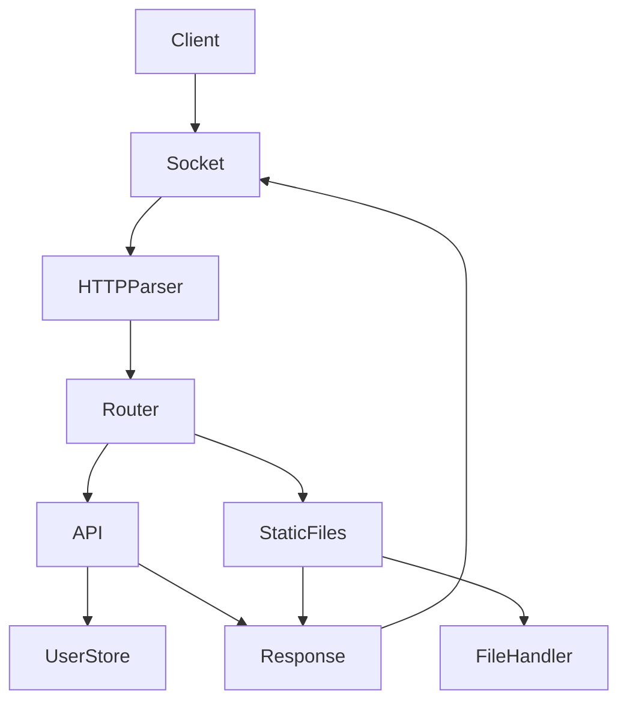

# C++ HTTP/1.1 Web Server

A high-performance, production-style, multi-threaded HTTP/1.1 web server built from scratch in C++ on Windows. This project utilizes the low-level **Windows Sockets 2 (Winsock2)** API to manage TCP connections, routes incoming HTTP requests to static assets or a REST API, protects against directory traversal vulnerabilities, supports custom thread pool concurrency, and provides native C++ benchmarking.

## 🚀 Overview

This is a low-level C++ systems and networking project built from scratch using:
*   **Modern C++ (C++17)** for server logic, memory management, and RAII safety.
*   **Winsock2 Sockets API** for TCP server socket creation, binding, listening, and non-blocking worker socket operations.
*   **Custom Thread Pool Concurrency** to efficiently execute network tasks across pre-allocated worker threads.
*   **CMake & MinGW** for build automation and multi-target compilation.
*   **Google Test (GTest)** for robust automated integration and unit testing.

---

## 🛠️ Features

*   **Winsock2 TCP Server**: Fully managed socket lifecycles including `WSAStartup`, socket creation, binding to local interfaces, listening, and accepting client TCP connections.
*   **HTTP/1.1 Protocol Support**:
    *   Header and query parameter parsing.
    *   Connection state management (HTTP Keep-Alive timeout loops and `Connection: close` socket recycling).
    *   HTTP method support for `GET`, `POST`, `PUT`, `PATCH`, `DELETE`, `HEAD` (response headers only), and `OPTIONS` (preflight responses with `Allow` headers).
    *   Automated injection of `Date` (GMT format) and `Server` headers.
*   **REST API Routing**: Endpoint dispatching for `/api/users` and `/api/info` with structured JSON validations (`nlohmann/json`), custom status codes (`200`, `201`, `204`, `400`, `403`, `404`, `405`, `415`, `505`), and a thread-safe in-memory `UserStore`.
*   **Static File Serving**: Serving of HTML, CSS, JavaScript, JSON, images, and plain text with automatic extension-based MIME type mapping.
*   **Security Hardening**:
    *   Percent-decoded path traversal protection: blocks traversal payloads (`/../`, `/%2e%2e/`, `..\\`) and returns `403 Forbidden`.
    *   Hidden file block (e.g. `.env`, `.secret`).
    *   Strict size limits: caps headers at 16KB and body payloads at 1MB, returning `413 Payload Too Large`.
    *   Robust Content-Length validation to prevent integer overflow exploits and conflicting duplicate headers.
*   **Thread-Safe Observability**: Mutex-synchronized timestamped logger including Thread IDs, logging HTTP transactions (`METHOD PATH STATUS BYTES DURATION`).
*   **Configurable Settings**: Centrally configured via `config/server.conf` or command-line parameters (port, host, thread count, request timeouts, limits, public root).
*   **Native Benchmarker**: Standalone C++ client benchmark runner to measure latency percentiles and throughput.

---

## 🏗️ Project Architecture



### Request-Response Pipeline Details
1. **TCP Accept**: The main loop accepts a client connection, applies receive/send timeouts (`SO_RCVTIMEO` / `SO_SNDTIMEO`), and assigns it to the `ThreadPool`.
2. **Read Loop**: A thread worker reads raw TCP segments until headers terminate (`\r\n\r\n`), enforcing max header limits.
3. **Validation**: The server validates Content-Length headers and reads the remaining body payload up to the configured limits.
4. **Router & Security**: Paths are URL-decoded and checked for directory traversals. API requests go to `RouteHandler`; static file requests go to `FileHandler` within the verified public root directory.
5. **Serialization**: `HttpResponse` builds the headers, appends `Date` and `Server` fields, sets correct `Content-Length`, and sends all data reliably over TCP using `sendAll()`.

---

## 📂 Directory Structure

```text
cpp-webserver/
├── 📁 benchmark/
│   ├── benchmark_runner.cpp       # Native C++ Winsock2 benchmarking utility
│   └── run_benchmarks.py          # Python benchmark wrapper
├── 📁 build/                      # Build artifacts output directory
├── 📁 config/
│   └── server.conf                # Default server configurations
├── 📁 public/                     # Server document root (HTML, CSS, JS)
├── 📁 results/                    # Execution logs, test reports, and CSV results
├── 📁 src/
│   ├── 📁 concurrency/
│   │   ├── thread_pool.h/cpp      # Fixed-size custom thread pool
│   ├── file_handler.h/cpp         # File system reader utility
│   ├── http_request.h/cpp         # HTTP parser and validator
│   ├── http_response.h/cpp        # Response builder and serializer
│   ├── http_status.h              # Status code map
│   ├── logger.h/cpp               # Thread-safe log output stream
│   ├── main.cpp                   # Main application entry point
│   ├── metrics.h                  # Active server diagnostics metric recorder
│   ├── route_handler.h/cpp        # REST API endpoints and router interface
│   ├── router.h/cpp               # URL path decoding and security checks
│   ├── server.h/cpp               # HttpServer socket loop implementation
│   ├── server_config.h/cpp        # Config parser (.conf & argv)
│   ├── socket_utils.h/cpp         # Reliable TCP send/recv wrappers
│   └── user_store.h/cpp           # Thread-safe database in-memory CRUD operations
├── 📁 tests/
│   ├── test_http_request.cpp      # HTTP request parser tests
│   ├── test_http_response.cpp     # Response serialization tests
│   ├── test_integration.cpp       # Full server integration, socket, and concurrency tests
│   ├── test_router.cpp            # URL decode and traversal protection tests
│   ├── test_thread_pool.cpp       # Concurrency pool tests
│   └── test_user_store.cpp        # CRUD mutex thread-safety tests
└── CMakeLists.txt                 # Build automation configurations
```

---

## ⚙️ Compilation & Build

To compile the web server, automated test suite, and benchmarking tool from scratch:

```bash
# Configure the build system (using MinGW Makefiles)
cmake -B build -G "MinGW Makefiles"

# Compile all targets
cmake --build build
```

The output executables will be located in the `build/` folder:
*   `webserver.exe` — The main HTTP server.
*   `webserver_tests.exe` — The automated test runner.
*   `benchmark_runner.exe` — The native C++ benchmarking utility.

---

## 🧪 Automated Testing

We maintain a comprehensive suite of **45 automated tests** using Google Test (GTest) covering units and full server integration. The integration tests launch the server in a separate background thread on a test port (`8081`) to simulate real socket interactions.

### Run Tests:
```bash
./build/webserver_tests.exe
```

### Verified Test Results:
*   **Total Tests**: 45
*   **Passed**: 45
*   **Failed**: 0
*   **Pass Rate**: 100%

Full test logs are saved in [results/test_results.txt](file:///c:/Users/hp/OneDrive/Desktop/cpp/cpp-webserver/results/test_results.txt) and security-specific logs are located in [results/security_tests.txt](file:///c:/Users/hp/OneDrive/Desktop/cpp/cpp-webserver/results/security_tests.txt).

---

## 📊 Performance Benchmarks

Benchmarks were gathered locally on a loopback interface (`127.0.0.1`) targeting the main server thread pool (configured with 4 worker threads) serving requests to a C++ Winsock2 client pool using TCP Keep-Alive connection reuse.

### 1. REST API Throughput (`GET /api/info` - 5,000 Total Requests)
| Concurrency (Clients) | Throughput (Req/Sec) | Avg Latency (ms) | p50 Latency (ms) | p95 Latency (ms) | p99 Latency (ms) |
| :--- | :--- | :--- | :--- | :--- | :--- |
| **10** | **21,808.2** | 0.42 | 0.16 | 0.23 | 11.43 |
| **25** | **21,717.9** | 0.88 | 0.16 | 0.23 | 3.85 |
| **50** | **16,800.5** | 1.69 | 0.17 | 0.28 | 15.28 |
| **100** | **17,659.6** | 2.81 | 0.16 | 0.52 | 123.31 |

### 2. Static File serving Throughput (`GET /index.html` - 1,000 Total Requests)
| Concurrency (Clients) | Throughput (Req/Sec) | Avg Latency (ms) | p50 Latency (ms) | p95 Latency (ms) | p99 Latency (ms) |
| :--- | :--- | :--- | :--- | :--- | :--- |
| **10** | **5,539.46** | 1.13 | 0.62 | 0.78 | 1.31 |
| **25** | **5,862.82** | 2.29 | 0.61 | 0.84 | 79.03 |
| **50** | **6,083.19** | 4.28 | 0.62 | 1.78 | 124.54 |
| **100** | **6,132.83** | 7.93 | 0.62 | 76.50 | 131.45 |

Full raw data are located in:
*   [results/benchmark_api.csv](file:///c:/Users/hp/OneDrive/Desktop/cpp/cpp-webserver/results/benchmark_api.csv)
*   [results/benchmark_static.csv](file:///c:/Users/hp/OneDrive/Desktop/cpp/cpp-webserver/results/benchmark_static.csv)
*   [results/benchmark_concurrency.csv](file:///c:/Users/hp/OneDrive/Desktop/cpp/cpp-webserver/results/benchmark_concurrency.csv)
